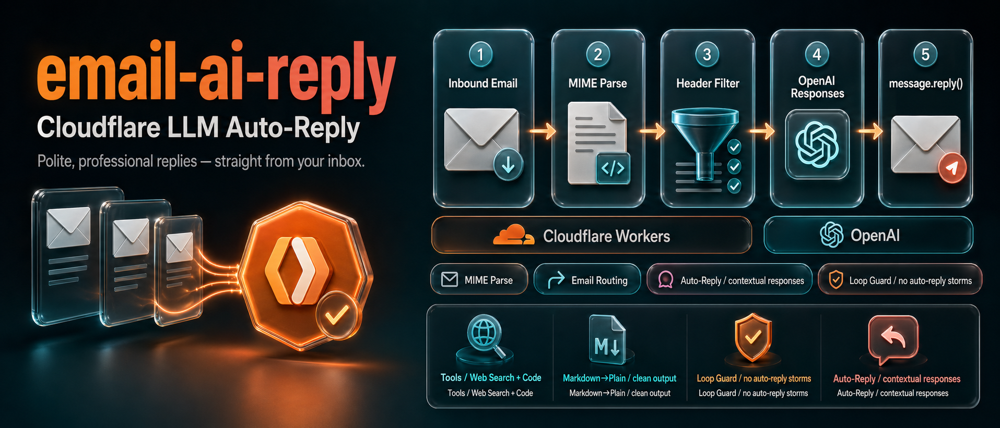

# email-ai-reply

Cloudflare Email Worker that automatically replies to incoming emails using AI.

**Anthropic Claude** is the primary provider. If Claude is unavailable, **OpenAI** is used as a transparent fallback — no configuration needed, just set both API keys.

## How it works

```
Inbound email → Cloudflare Email Routing
  → postal-mime parses MIME (charset, nested multipart, RFC 2047)
  → policy guard (anti-loop, domain filters)
  → Claude generates reply  →  fallback: OpenAI
  → mimetext composes reply (In-Reply-To, References, Auto-Submitted)
  → message.reply()
```

## Setup

### 1. Install dependencies

```bash
npm install
```

### 2. Set API keys as secrets

```bash
# Primary — Anthropic Claude
wrangler secret put ANTHROPIC_API_KEY

# Fallback — OpenAI (optional but recommended for HA)
wrangler secret put OPENAI_API_KEY
```

### 3. Configure Cloudflare Email Routing

In the Cloudflare dashboard, route your target address to this Worker. The Worker uses the routed-to address as the `From` of all replies.

### 4. Deploy

```bash
npm run deploy
```

### 5. Health check

```bash
curl https://<your-worker>.workers.dev/health
```

## Configuration (`wrangler.toml` `[vars]`)

| Variable | Default | Description |
|---|---|---|
| `ANTHROPIC_MODEL` | `claude-sonnet-4-6` | Anthropic model to use |
| `OPENAI_MODEL` | `gpt-5.2` | OpenAI model (fallback) |
| `OPENAI_BASE_URL` | `https://api.openai.com` | Override to use a proxy |
| `OPENAI_ENABLE_WEB_SEARCH` | `true` | Enable web search tool on OpenAI |
| `MAX_OUTPUT_TOKENS` | `1024` | Max tokens in the AI reply |
| `TIMEOUT_MS` | `30000` | Per-provider timeout (ms) |
| `SYSTEM_PROMPT` | *(see wrangler.toml)* | System/instruction prompt |
| `ALLOW_DOMAINS` | *(empty)* | CSV — only reply to these sender domains |
| `BLOCK_DOMAINS` | *(empty)* | CSV — never reply to these sender domains |

## Provider fallback logic

1. If `ANTHROPIC_API_KEY` is set → try Anthropic first.
2. On any Anthropic error (network, 5xx, 429, overload) → fall back to OpenAI if `OPENAI_API_KEY` is set.
3. Auth errors (`401`/`403`) do **not** fall back — they indicate misconfiguration and are surfaced immediately.
4. If only one key is set, that provider is used with no fallback.

## Anti-loop protection

All outbound replies include:

```
Auto-Submitted: auto-replied
Precedence: bulk
X-Auto-Response-Suppress: All
```

Inbound mail is silently dropped if it carries `Auto-Submitted` (not `no`), `List-Id`, `Precedence: bulk/junk/list`, or `X-Auto-Response-Suppress`.

## Directory structure

```
worker.js              Entry point (email + /health)
src/
  ai/client.js         Unified AI: Anthropic primary, OpenAI fallback
  core/config.js       Config loading from env
  core/log.js          Structured JSON logger
  email/guards.js      shouldReply() + resolveReplyTo()
  email/compose.js     MIME reply composition (via mimetext)
```

## License

MIT
